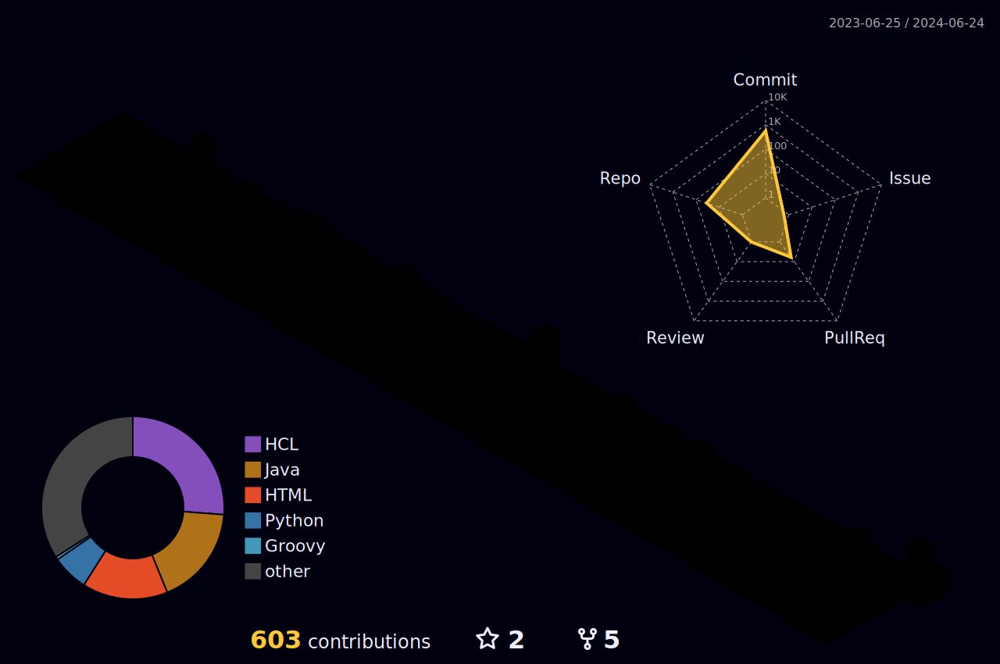

<!--  -->

 

 
  <!-- görüntüleme sayisi -->

<!-- <h2 align="center"> -->   <!-- cizgi eklemek icin -->
<!-- </h2>  -->

<!-- Coder Uncle Pic               Burasi bir gif

 -->

<!-- yorum satiri
<h2 dir="auto"><a id="user-content-necktie-about-me" class="anchor" aria-hidden="true" href="#necktie-about-me"><svg class="octicon octicon-link" viewBox="0 0 16 16" version="1.1" width="16" height="16" aria-hidden="true"><path fill-rule="evenodd" d="M7.775 3.275a.75.75 0 001.06 1.06l1.25-1.25a2 2 0 112.83 2.83l-2.5 2.5a2 2 0 01-2.83 0 .75.75 0 00-1.06 1.06 3.5 3.5 0 004.95 0l2.5-2.5a3.5 3.5 0 00-4.95-4.95l-1.25 1.25zm-4.69 9.64a2 2 0 010-2.83l2.5-2.5a2 2 0 012.83 0 .75.75 0 001.06-1.06 3.5 3.5 0 00-4.95 0l-2.5 2.5a3.5 3.5 0 004.95 4.95l1.25-1.25a.75.75 0 00-1.06-1.06l-1.25 1.25a2 2 0 01-2.83 0z">

### </path></svg></a> About Me ✅ </h2>
-->

<a href="https://discord.gg/hanzelkaraagac">
<strong> Click here to join our Discord server ⬅️ </a>

<!-- %7C -> alttaki yaziya | eklememize yariyor  yüzde isareti isaret icin-->

<!--   
<h3 align="left">Skills: Java | Selenium | JUnit | TestNG | Cucumber | Git - GitHub | Html - Css | JIRA | PostgreSQL | LAMBDA | JDBC | API | </h3>
 -->
## <b> Languages and Tools:</b>
</a> 
 <a href="https://www.python.org/" target="_blank" rel="noreferrer">    <a href="https://www.w3.org/html/" target="_blank" rel="noreferrer">    <a href="https://www.mysql.com/" target="_blank" rel="noreferrer"><a href="https://www.selenium.dev/" target="_blank" rel="noreferrer">   
 </a>
     <!-- renkli cizgi kismi -->
 

 

 
 
  
  
  
  
  
  
  

 
<!--   üc boyutlu  -->   

    <!-- yilanin oldugu kisim -->

<!-- 
name: GitHub-Profile-3D-Contrib

on:
  schedule: # 03:00 JST == 18:00 UTC
    - cron: "0 18 * * *"
  workflow_dispatch:

jobs:
  build:
    runs-on: ubuntu-latest
    name: generate-github-profile-3d-contrib
    steps:
      - uses: actions/checkout@v3
      - uses: yoshi389111/github-profile-3d-contrib@0.7.1
        env:
          GITHUB_TOKEN: ${{ secrets.GITHUB_TOKEN }}
          USERNAME: ${{ github.repository_owner }}
      - name: Commit & Push
        run: |
          git config user.name github-actions
          git config user.email github-actions@github.com
          git add -A .
          git commit -m "generated"
          git push
-->

 
 
##  <b>My Stats</b>

  
  
  

<!--  -->

## 🌐 Socials:
  

# 💻 Tech Stack:
               
# 📊 GitHub Stats:
 
 

## 🏆 GitHub Trophies

### ✍️ Random Dev Quote

### 🔝 Top Contributed Repo

---

<!-- Proudly created with GPRM ( https://gprm.itsvg.in ) -->

### Hi there 👋, my name is Ahmet Aksoy
#### DevOps Engineer

With about 2 years of experience in DevOps, I am open-minded and passionate about automating IT processes. I am particularly passionate about developing and implementing effective Continuous Integration and Delivery (CI/CD) pipelines. I rely on best practices such as containerisation, orchestration, monitoring, infrastructure automation tools, as well as configuration management tools, cloud solutions and a desire to learn new technologies.

Skills: AWS | Kubernetes | Docker | Python | Jenkins | Ansible | Terraform  | GitHub | Linux | Azure | Argocd |

- 🔭 I’m currently working on this page. 
- 🌱 I’m currently learning asdasdasdasd 
- 👯 I’m looking to collaborate on adasda 
- 🤔 I’m looking for help with asdadasd 
- 💬 Ask me about adadasd 
- 📫 How to reach me: asdasda 
- 😄 Pronouns: asdasdas 
- ⚡ Fun fact: asdasdad 

          

 

  

  

<!-- Bu Kisim ilk bastaki sekilde>

<!-- <h1 align="center">Hi 👋, I'm Ahmet Aksoy</h1>
<h3 align="center">Devops Engineer</h3>

  

- 🌱 I’m currently learning **Docker**

<h3 align="left">Connect with me:</h3>

<h3 align="left">Languages and Tools:</h3>

                
 -->

